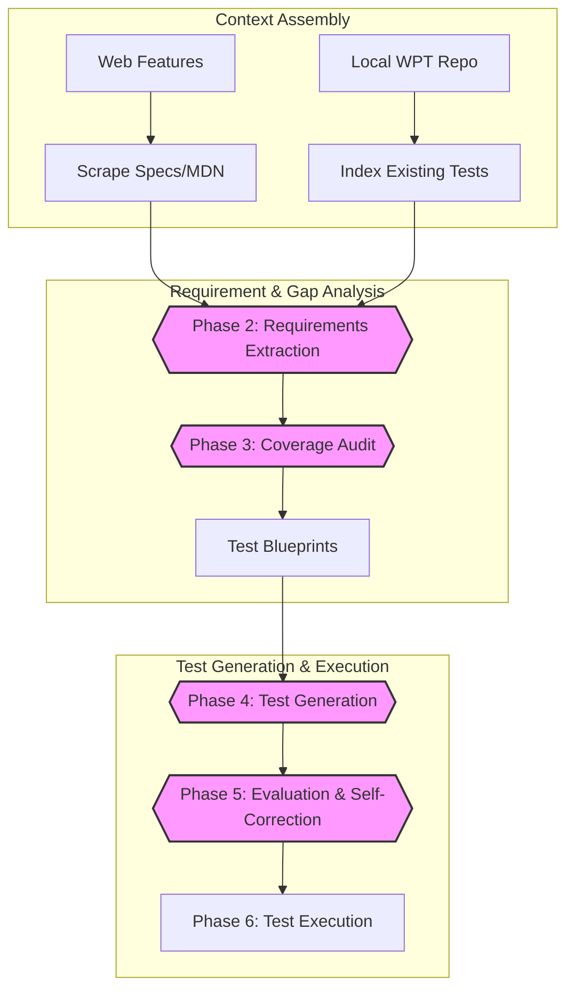

# WPT-Gen: AI-Powered Web Platform Test Generation

[](https://opensource.org/licenses/Apache-2.0)
[](https://www.python.org/downloads/)

**WPT-Gen** is an agentic CLI tool designed to increase browser interoperability by automating the creation of [Web Platform Tests (WPT)](https://web-platform-tests.org/).

By bridging the gap between W3C Specifications and local WPT repositories, WPT-Gen uses Large Language Models (LLMs) to proactively identify testing gaps and generate high-quality, compliant test cases.

## Why WPT-Gen?

Browser interoperability is critical for the web. While the W3C and WHATWG write specifications, there is often a gap between those specs and the tests that ensure browsers implement them correctly. **WPT-Gen** bridges this gap by:
- **Reducing Manual Effort:** Automating the tedious process of mapping spec assertions to existing tests.
- **Ensuring High Coverage:** Identifying missing edge cases and suggesting specific test scenarios.
- **Standardizing Compliance:** Generating tests that adhere to strict WPT style guides and directory structures.

## Key Features

*   **Context Assembly:** Automatically resolves Web Feature IDs (via `web-features`) to fetch W3C Spec URLs and technical documentation.
*   **Deep Local Analysis:** Scans your local WPT repository using `WEB_FEATURES.yml` metadata to identify existing tests and their dependencies.
*   **Gap Analysis:** Compares technical requirements synthesized from specifications against current test coverage to pinpoint missing assertions.
*   **Test Suggestions:** Brainstorms specific, actionable test scenarios (blueprints) that address identified gaps.
*   **Automated Generation:** Produces atomic, WPT-compliant HTML and JavaScript test files based on user-approved blueprints.
*   **Multi-Provider Support:** Built-in support for Google Gemini (via `google-genai`), OpenAI, and Anthropic models.

## How it Works

WPT-Gen follows a structured, multi-phase agentic workflow. Each phase is designed to build upon the last, culminating in high-quality, verified test cases.



### Workflow Phases

1.  **Phase 1: Context Assembly:** Aggregates the "Source of Truth" from external documentation (W3C Specs, MDN) and identifies existing test coverage in the local WPT repository.
2.  **Phase 2: Requirements Extraction:** Uses an LLM to synthesize specification text into structured, granular technical requirements. Supports parallel and iterative extraction modes for complex specs.
3.  **Phase 3: Coverage Audit:** Performs a delta analysis by comparing the synthesized requirements against the local test suite. This phase outputs an audit worksheet and high-level test blueprints.
4.  **Phase 4: Test Generation:** Translates user-selected blueprints into functional WPT-compliant code (JavaScript, Reftests, or Crashtests) using Jinja2 templates and specific style guide instructions.
5.  **Phase 5: Evaluation (Self-Correction):** A secondary LLM pass reviews the generated code against WPT standards and the original requirements, providing fixes or optimizations before final output.
6.  **Phase 6: Test Execution:** Integrates with the `./wpt run` CLI to verify that the newly generated tests are valid and functional in a real browser environment.

## Prerequisites

*   **Python 3.10+**
*   **Local WPT Repository:** A local checkout of [web-platform-tests/wpt](https://github.com/web-platform-tests/wpt).
*   **API Key:** An API key for a supported LLM (Gemini, OpenAI, or Anthropic).

## Installation

```bash
# Clone the repository
git clone https://github.com/google/wpt-gen.git
cd wpt-gen

# Install the package (using a virtual environment is recommended)
python -m venv .venv
source .venv/bin/activate
pip install -e .
```

To install development dependencies:
```bash
pip install -e ".[dev]"
```

## Configuration

WPT-Gen uses a combination of a YAML configuration file and environment variables.

### 1. Environment Variables
You must export the API key for your chosen provider. These are never stored on disk.

```bash
export GEMINI_API_KEY="your_gemini_api_key"
# OR
export OPENAI_API_KEY="your_openai_api_key"
# OR
export ANTHROPIC_API_KEY="your_anthropic_api_key"
```

### 2. YAML Configuration (`wpt-gen.yml`)
Create a `wpt-gen.yml` in the root of the project to manage defaults:

```yaml
default_provider: gemini
wpt_path: /path/to/your/local/wpt  # Path to your local WPT checkout
show_responses: false              # Set to true to see raw LLM outputs by default

providers:
  gemini:
    default_model: gemini-3.1-pro-preview
    categories:
      lightweight: gemini-3-flash-preview
      reasoning: gemini-3.1-pro-preview
  openai:
    default_model: gpt-5.2-high
    categories:
      lightweight: gpt-4o-mini
      reasoning: gpt-5.2-high
  anthropic:
    default_model: claude-3-7-sonnet-20250219
    categories:
      lightweight: claude-3-5-haiku-20241022
      reasoning: claude-3-7-sonnet-20250219


phase_model_mapping:
  requirements_extraction: reasoning
  coverage_audit: reasoning
  generation: lightweight
```

## Usage

The primary interface is the `generate` command, which requires a **Web Feature ID** (as defined in the [web-features](https://github.com/web-platform-dx/web-features) repository).

### Basic Generation

```bash
wpt-gen generate grid
```

### Command Options

| Option | Shorthand | Description |
| :--- | :--- | :--- |
| `web_feature_id` | (Arg) | **Required.** The ID of the feature (e.g., `grid`, `popover`). |
| `--provider` | `-p` | Override the default LLM provider (`gemini`, `openai`, or `anthropic`). |
| `--wpt-dir` | `-w` | Override the path to the local web-platform-tests repository. |
| `--config` | `-c` | Path to a custom `wpt-gen.yml` file. |
| `--show-responses`| `-s` | Display every LLM-generated response to the user. |
| `--use-lightweight`| | Use the provider's lightweight model for all LLM requests. |
| `--use-reasoning`| | Use the provider's reasoning model for all LLM requests. |


## Development

### Running Tests
We use `pytest` for unit and integration testing.

```bash
pytest
```

### Linting & Formatting
We use `ruff` to maintain code quality and `mypy` for type checking.

```bash
# Lint and format
ruff check .
ruff format .

# Type check
mypy .
```

## AI Assistant Integration

This repository includes a `GEMINI.md` and a suite of AI skills in the `.agents/skills/` directory to help AI assistants (like Gemini Code Assist) better understand the project's architecture, dependencies, and testing standards. You can point your AI assistant to `GEMINI.md` for a comprehensive overview of how to contribute accurately to the codebase.

## License

Apache 2.0. See [LICENSE](LICENSE) for more information.

## Source Code Headers

Every file containing source code must include copyright and license information.

Apache header:

    Copyright 2026 Google LLC

    Licensed under the Apache License, Version 2.0 (the "License");
    you may not use this file except in compliance with the License.
    You may obtain a copy of the License at

        https://www.apache.org/licenses/LICENSE-2.0

    Unless required by applicable law or agreed to in writing, software
    distributed under the License is distributed on an "AS IS" BASIS,
    WITHOUT WARRANTIES OR CONDITIONS OF ANY KIND, either express or implied.
    See the License for the specific language governing permissions and
    limitations under the License.
